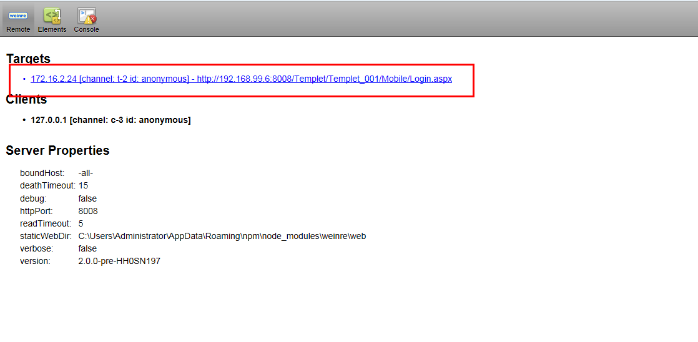
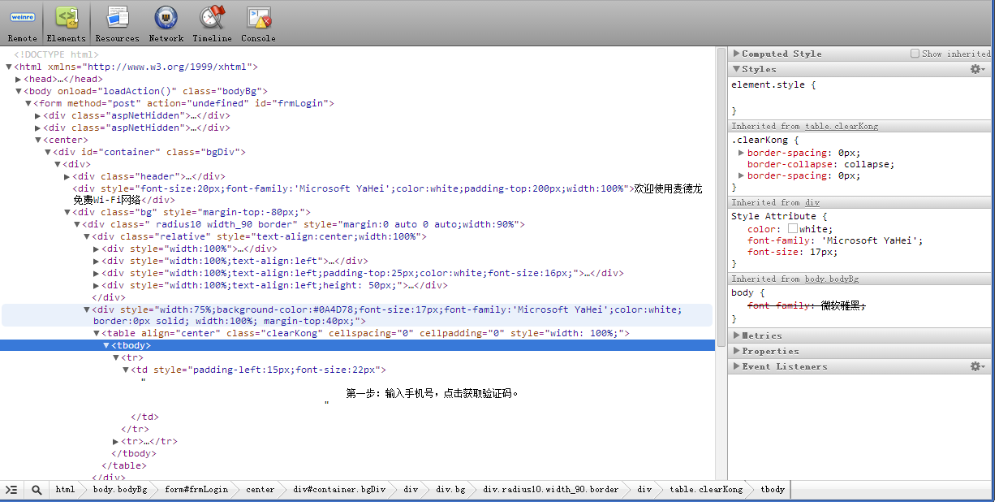

# weinre
是一款基于Web Inspector(Webkit)的远程调试工具， 它使用JS编写， 可以让我们在电脑上直接调试运行在手机上的远程页面。 [weinre入门手册](https://github.com/nupthale/weinre)

## 安装
1. 安装`Nodejs`
1. 命令行中输入 `npm -g install weinre`

## 启动
1. 运行cmd，键入命令 `weinre -httpPort 8008 -boundHost -all-` (启动weinre后，cmd窗口不能关闭)
1. PC端打开浏览器（任何一个浏览器），访问：`http://localhost:8008`，确认是否启动成功。
1. 将如下脚本追加到你将要调试的页面上（IP地址为需要进行远程监控的电脑IP）
    ``
1. 将要调试的Web页面发布到服务器
1. 手机端使用任意浏览器打开需要调试的页面。
1. PC访问http://localhost:8008，点击http://localhost:8008/client/#anonymous

1. 点击需要调试的页面超链接，选择Elements，即可进行调试

